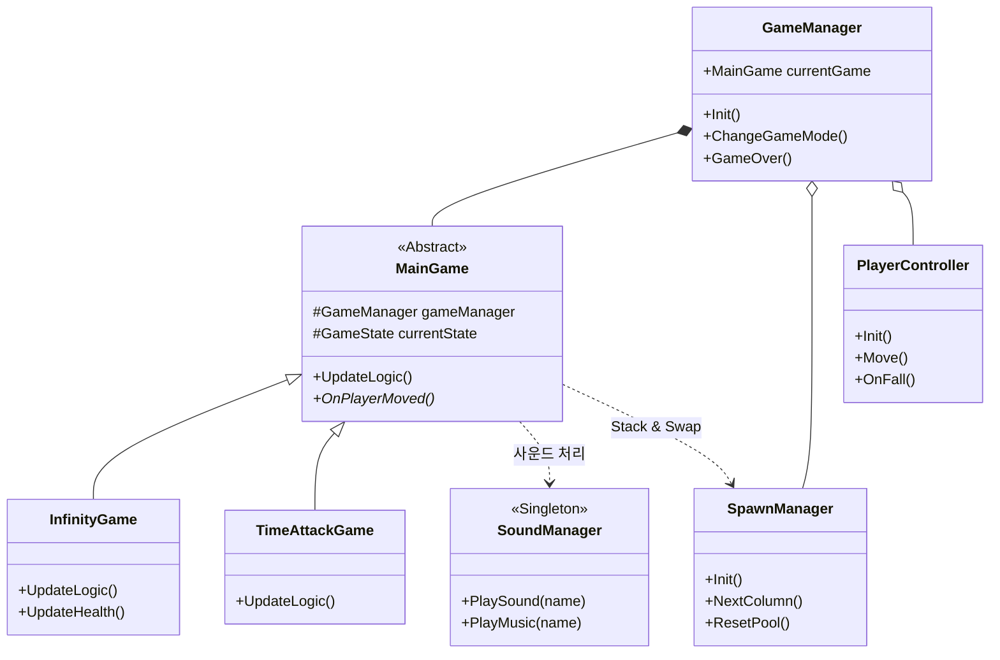
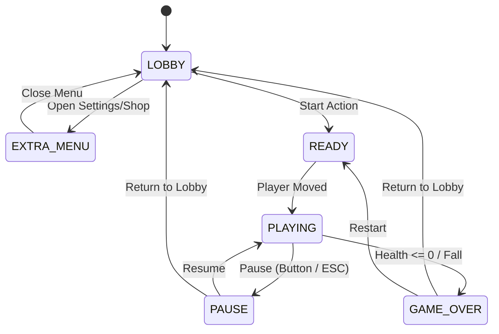

# Infinity Column

  
  
  
  
  

 
Unity로 개발한 복셀 스타일의 <b>캐주얼 아케이드 게임 프로젝트</b>입니다. 

 
간단한 터치나 방향 조작으로 기둥의 뻗어 나오는 가지들을 피하며  
하늘로 올라가 최대 기록을 갱신하는 것이 목표인 게임입니다.  

 

### 개발 정보
+ 개발 기간 : 2024.10 ~ 2025.03
+ 개발 인원 : 2인
+ 지원 언어 : English, 한국어, 日本語
+ 타겟 플랫폼 : Windows (준비 중), Android, iOS

 

기획 의도 - 복셀 스타일로 간단한 캐주얼 아케이드 게임 만들어보기!

 

## 프로젝트 팀원 (Team.Campfire)
| 윤창범 | 정도근 | 
|:---:|:---:|
|  |  | 
| **프로그래밍**   **복셀 모델링**   UI 디자인 & BGM | 복셀 모델링 | 

 

## 개발 환경
+ Unity (2023.2.20f1 -> 6000.0.58f2) [보안 이슈 대응]
+ MagicaVoxel
+ C#
+ Windows / macOS

 

## 주요 기술
| 기술 |  |
|:---:|:---|
| 싱글톤 패턴 | [MonoSingleton&lt;T&gt;](https://github.com/dbsckdqja75/InfinityColumn/blob/main/Assets/02.%20Scripts/Pattern/MonoSingleton.cs) 구현으로 주요 매니저 클래스 관리   [SoundManager](https://github.com/dbsckdqja75/InfinityColumn/blob/main/Assets/02.%20Scripts/Manager/SoundManager.cs), [CurrencyManager](https://github.com/dbsckdqja75/InfinityColumn/blob/main/Assets/02.%20Scripts/Manager/CurrencyManager.cs), [CharacterManager](https://github.com/dbsckdqja75/InfinityColumn/blob/main/Assets/02.%20Scripts/Manager/CharacterManager.cs) 등 |
| 전략 패턴 | 추상 클래스 중심으로 게임 모드 확장 구조 구현   [MainGame](https://github.com/dbsckdqja75/InfinityColumn/blob/main/Assets/02.%20Scripts/InGame/Main/MainGame.cs), [InfinityGame](https://github.com/dbsckdqja75/InfinityColumn/blob/main/Assets/02.%20Scripts/InGame/Main/InfinityGame.cs), [TimeAttackGame](https://github.com/dbsckdqja75/InfinityColumn/blob/main/Assets/02.%20Scripts/InGame/Main/TimeAttackGame.cs) |
| 상태 머신 | [GameState](https://github.com/dbsckdqja75/InfinityColumn/blob/main/Assets/02.%20Scripts/Enum/GameState.cs)를 통한 상태 전이 로직으로 게임 흐름 제어 ([MainGame](https://github.com/dbsckdqja75/InfinityColumn/blob/main/Assets/02.%20Scripts/InGame/Main/MainGame.cs))   [Lobby -> Ready -> Playing -> Pause -> GameOver] |
| 오브젝트 풀링 | [SpawnManager](https://github.com/dbsckdqja75/InfinityColumn/blob/main/Assets/02.%20Scripts/Manager/SpawnManager.cs) 구현으로 기둥 (가지), FX 등 자주 생성되고 파괴되는 객체들은 재사용 관리 및   Stack & Swap 방식의 동적 기둥 생성 구현 |
| 데이터 저장   &   암호화 | 중요 변수 또는 저장 데이터들을   [PlayerPrefsManager](https://github.com/dbsckdqja75/InfinityColumn/blob/main/Assets/02.%20Scripts/Manager/PlayerPrefsManager.cs), [EncryptAES](https://github.com/dbsckdqja75/InfinityColumn/blob/main/Assets/02.%20Scripts/Others/EncryptAES.cs) 구현으로 **AES암호화**하여 관리 |
| 사운드 관리 | [SoundManager](https://github.com/dbsckdqja75/InfinityColumn/blob/main/Assets/02.%20Scripts/Manager/SoundManager.cs) 구현으로 인게임의 모든 BGM과 SFX 리소스 관리 및 **Coroutine** 기반으로   Volume, Mute, CrossFade 제어 |

 

## 프로젝트 설계 구조 (다이어그램)
### 시스템 전체 구조

### 인게임 진행 상태 전이 흐름 구조

전반적인 구조는 **매니저 패턴**과 **전략 패턴**을 활용하여 구현하였고  
메인 게임 로직은 공통 추상 클래스 기반의 상태 전이 제어 구조로 설계했습니다. 

오브젝트 풀링의 경우에는 플레이 환경 특성상 기둥 생성이 가장 성능에 영향을 많이 주기 때문에 
별도의 [SpawnManager](https://github.com/dbsckdqja75/InfinityColumn/blob/main/Assets/02.%20Scripts/Manager/SpawnManager.cs)에서 전담하여 기둥 테마에 따라 일정 높이에 맞추어 교체하며 생성하는 방식으로 관리했습니다.

 

## 기술적 이슈와 아쉬운 점
+ **UI 관리 구조 미흡** 
> 진행 상태에 따라 각각의 UI를 제어하는 별도 클래스로 나누어 구현했으나, 게임 로직을 담당하는 클래스에서  
직접적으로 UI 클래스에 관여하는 상태이며 차라리 모든 UI 처리를 이벤트 기반으로  
전환하여 구현했다면 수정에 좀 더 용이했을거라 생각함.

 

## 트레일러 & 플레이 영상

  
  

 

## 기타 정보
+ MagicaVoxel 파일의 Import와 Rigging/Animation 작업은 [Voxel Importer](https://assetstore.unity.com/packages/tools/modeling/voxel-importer-62914)와 [Very Animation](https://assetstore.unity.com/packages/tools/animation/very-animation-96826?locale=ko-KR) 에셋을 활용하여 작업했습니다.
+ 파티클 이펙트와 사운드 효과음은 유료 에셋을 수정 및 활용하였습니다.
+ 저장소에 반영된 **AES 암호화 키**는 테스트 더미 키값으로 실제 실행 환경에는 다른 키값이 적용되어있습니다.
+ 기능/이펙트 유료 에셋 패키지의 실제 리소스는 저장소에 포함되어있지 않습니다.

 

## 게임 다운로드
### <a href="https://play.google.com/store/apps/details?id=com.TeamCampfire.InfinityColumn&hl=ko">구글 플레이 스토어 (Android)</a>
### <a href="https://apps.apple.com/kr/app/%EB%AC%B4%ED%95%9C%EC%9D%98-%EA%B8%B0%EB%91%A5/id6743107597">앱스토어 (iOS)</a>

